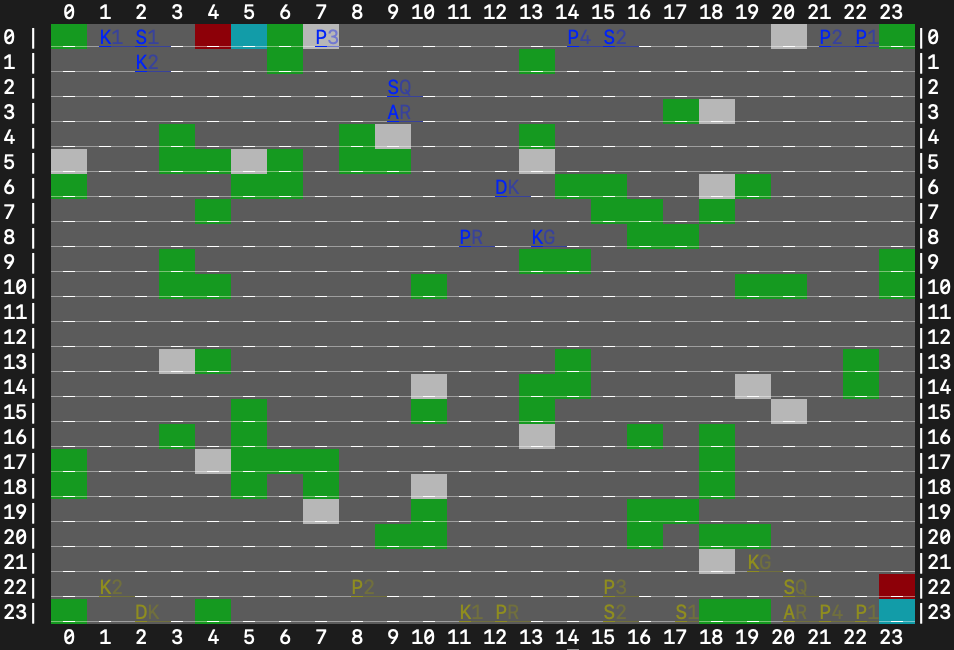

# Feudal AI
### Authors: Artjom Plaunov (Hunter College) and Daniel Mallia (Hunter College)
### Course: A.I. (CSCI 761 / CSC 740), Dr. Anita Raja, Spring 2022

### Feudal Board Game
Feudal is a chess-like board game with a number of added complexities. While
the pieces possess moves similar to those of chess pieces, a single turn for a
player may involve moving up to all of the player's pieces (a minimum of 1 must
be moved), and the board, which may be oriented in different fashions, features
terrain (rough terrain and mountains) which prohibits certain movements. This
ability to change the board is complemented by the requirement of a setup
phase, where each player must choose how to setup their pieces. Furthermore,
there are two ways to achieve victory, either by getting a piece into the
enemy's castle interior, or by eliminating all of the enemy's royalty pieces
(king, prince, duke). Perhaps the most astonishing element is, given
particularly poor and aggressive setups, it is hypothetically possible to win
the game in a single turn by an aggressive player.

More information can be found here:
- [Feudal on Wikipedia](https://en.wikipedia.org/wiki/Feudal_(game))
- [Feudal on Board Game Geek](https://boardgamegeek.com/boardgame/847/feudal)

### Restrictions
- We are restricting the number of moves possible in a single turn, and
requiring that the moves specified adhere to the order of how pieces are
specified in the game manual (this "ordering" is not meaningful in the
original game); ordering among pieces of the same type or value, must proceed
from left to right, or, in the final instance, by the number assigned to each
piece instance (i.e. Knight 1 > Knight 2). This is done to cope with the
combinatorial explosion induced by permitting moving up to all 13 beginning
pieces in a single move, in any order. Our plan is to restrict this to 4 moves,
still permitting the ability to wipe out all royalty in a single turn; at the
moment we are testing with 1 move.
- For now we are going to work with a single board configuration, rather than
experimenting with varying the board.

### Implementation
We are implementing the game as a terminal application, where all visualization
of the game is done via printing with ANSI escape codes for colors and other
effects, using Python 3 (minimum 3.8.5).

The below is a screenshot of the game after both players, blue and brown, have
placed their pieces.

This particular board setup was taken from a
[video about the original 3M version of the game.
](https://www.youtube.com/watch?v=LUV_zHb_xnM)

### Visual Guide:
The following describes the mapping of visual aspects to game features:

- Grid - row and column indicators, indexed from 0 to 23, are present; for ease
of identifying the center of each cell (which is 3 spaces wide), the center is
marked by a bold underlining.
- Pieces - a two-character indicator (the first letter is always in the middle
space of the cell), where the second character may be a number if it is
indicating a piece type of which there are multiple (knights, pikemen,
sergeants). These indicators take on colors appropriate to the team, either
blue or brown.
- Mountains - green background
- Rough terrain - white background
- Castle green - cyan background
- Castle interior - red background
- Empty / normal terrain - gray background

